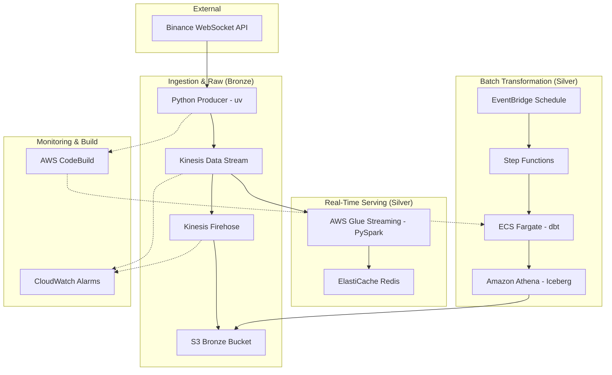

# AWS Real-Time Market Data Engineering Stack

A high-performance, serverless data pipeline for ingesting, processing, and serving live cryptocurrency market data from Binance.

## 🏗️ Technical Architecture

### High-Level Data Flow



### Component Details

| Component | AWS Resource | Purpose |
| :--- | :--- | :--- |
| **Ingestion** | `aws_kinesis_stream` | Low-latency entry point for trade data. |
| **Delivery** | `aws_kinesis_firehose_delivery_stream` | Micro-batching raw JSON to S3. |
| **Storage** | `aws_s3_bucket` | Bronze layer (raw) and Silver layer (Iceberg). |
| **Streaming** | `aws_glue_job` | PySpark job for 10s rolling averages. |
| **Serving** | `aws_elasticache_cluster` | Redis for sub-millisecond aggregation access. |
| **Orchestration**| `aws_sfn_state_machine` | Scheduling dbt runs via Fargate. |
| **Transformation**| `dbt-athena-community` | SQL-based ELT in Iceberg format. |

---

## 🚀 Deployment Guide

### Prerequisites
- AWS CLI configured with `AdministratorAccess`.
- `uv` (Python package manager).
- Terraform installed.

### 1. Infrastructure Setup
```bash
cd terraform
terraform init
terraform apply -auto-approve
```

### 2. Build & Push dbt Container
The stack uses **AWS CodeBuild** to handle containerization since local Docker might be restricted.
```bash
# Upload dbt source to S3 (CodeBuild will trigger)
zip -r transforms.zip transforms/
aws s3 cp transforms.zip s3://$(terraform output -raw s3_bucket_name)-glue-assets/dbt_source.zip
# Start the build
aws codebuild start-build --project-name market-data-dbt-build
```

### 3. Start Ingestion
```bash
cd producer
uv run producer.py
```

### 4. Verify Monitoring
- **Athena**: Run `SELECT * FROM market_data_db.stg_market_data` to see transformed trades.
- **Redis**: Connect to the endpoint for `btcusdt_rolling_avg` metrics.
- **CloudWatch**: Check alarms for `KinesisIteratorAge` and `FirehoseDeliverySuccess`.

---

## 🛠️ Development

### Local Python Setup
Modules are managed via `uv` for speed and reproducibility.
```bash
uv sync --all-groups
```

### dbt Development
```bash
cd transforms/market_data_transforms
dbt debug
dbt run
```

---

## 🛡️ Security & Resiliency
- **VPC Isolation**: Glue and Redis run in a private VPC with VPC Endpoints for S3, Kinesis, and Logs.
- **Least Privilege**: IAM roles are scoped to specific resource ARNs and actions.
- **Iceberg Format**: Silver layer ensures ACID compliance and efficient schema evolution.
